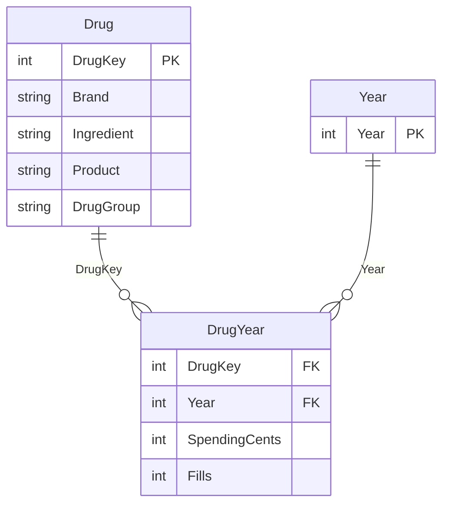

# Model and source rules

Both active relationships filter from the dimension's **one** side to the fact table's **many** side. Cross-filter direction is single, not bidirectional. There is no relationship between the two dimension tables. This is an annual model; no daily date table or automatic date hierarchy is required for the explicit previous-year measures.

| Table / field | Grain, type, and meaning |
|---|---|
| Drug | One unique Overall brand + ingredient combination in the pinned release; 3,625 rows. |
| Drug.DrugKey | Integer surrogate key assigned after sorting the source names; hidden from report authors. Both imports reference the same staging query. |
| Drug.Brand / Ingredient | CMS brand and generic ingredient names, preserved as text. |
| Drug.Product | `Brand (Ingredient)` display label, used for the single-product selector. |
| Drug.Drug group | Exact ingredient membership: `GLP-1 / GIP` or `Other listed products`. Clearing the filter includes both. |
| Year | Five integer observation years, 2020–2024. Year is the unique key and is not summarized. |
| DrugYear | One row for each available drug + year observation; composite key is DrugKey + Year. |
| DrugYear.SpendingCents | Nonnegative gross spending stored as integer cents. The measure divides the sum by 100. |
| DrugYear.Fills | Positive whole prescription claim count, including refills. Not unique people. |

## Import pipeline

1. `CMS Overall` reads the fixed June 2026 CMS CSV and retains only `Mftr_Name = Overall`. It rejects duplicate brand + ingredient keys.
2. `Drug` creates a display label and an explicit ingredient group. Insulin combinations and GLP-2 products are not included in that selected group.
3. `DrugYear` expands the five annual sets of source fields into a long table. It parses source numerals using `en-US`, rounds monetary values to cents, removes unavailable spending observations, and rejects invalid fill denominators.
4. `Year` supplies the complete annual axis. Blank historical spending remains unavailable. The absence of a product-year row is never imputed as zero.

The Power Query import follows the Python pipeline's analytical grain and money convention. The Python downloader checks the source SHA-256. Power Query uses the same fixed release URL; it **does not independently compute that checksum**. The report's reference controls flag changed 2024 totals, and a full byte-identity review can be performed with the Python pipeline if the source changes.

## Nonadditive quantities and coverage

Do not sum distinct beneficiaries across drugs; the same person can use several products. That field is deliberately absent from this model. Do not average the individual product averages: use the spending and fill totals. The model does not compare dosage-unit costs across ingredients.

Historical totals describe products included in this release, not a complete census of every historical product. New or unavailable observations can affect aggregate growth. The single-product bridge needs a usable observation in both years and is an arithmetic identity, not a causal estimate.

All source definitions and limits are in the repository's [methodology](../METHODOLOGY.md) and [CMS source manifest](../source.json).
